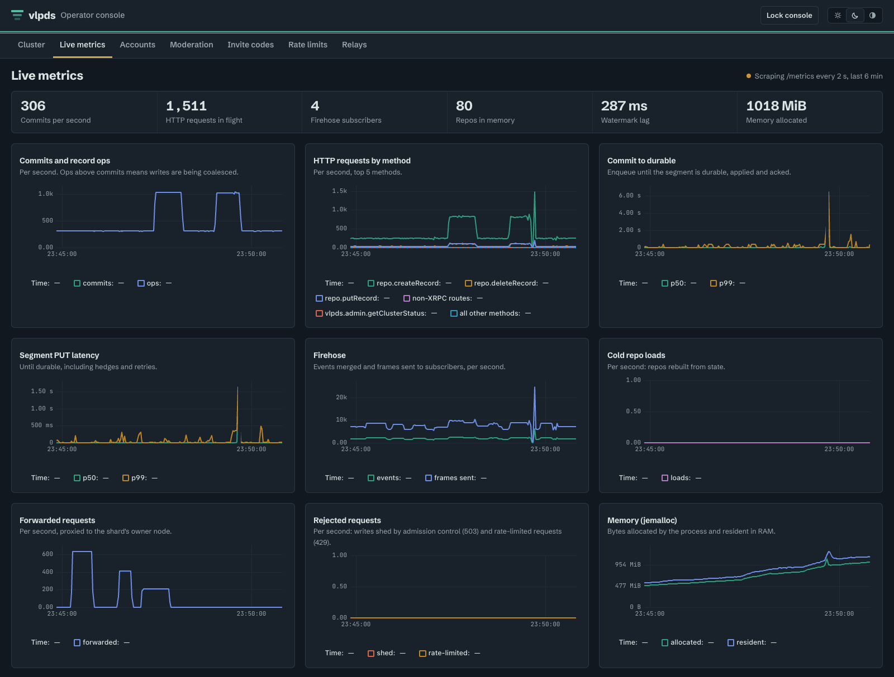

# vlpds

**An atproto PDS where the object store is the database.** Every acknowledged write is already in
your S3, R2 or GCS bucket; nodes keep only caches, and scaling out means starting another node on
the same bucket.



vlpds speaks the same XRPC, OAuth and sync 1.1 firehose as the reference PDS, so apps, relays and
AppViews talk to it like any other PDS. It runs a personal server on one small VM and a cluster on
as many nodes as you give it.

## Highlights

- **The bucket is the only durable state.** Writes are group-committed into log segments with
  conditional PUTs, and per-shard state lives in SlateDB on the same bucket. A lost node or disk costs
  cache, never data. → [Overview](docs/overview.md), [Record storage](docs/record-storage.md)
- **Clustered without a coordinator.** Any node serves any request. Shards are owned through leases
  and compare-and-swap on objects in the bucket (no Raft, no ZooKeeper); a crashed node's shards
  move in seconds, and shards split and merge online. → [Architecture](docs/architecture.md),
  [Scaling and clustering](docs/operations/scaling-and-clustering.md)
- **Fast, and cheap when idle.** ~60k commits/s on one 16-core node against a store with 25 ms of
  injected latency, and a one-shard personal server that idles inside R2's free request tier
  (measured: [`bench/results/`](bench/results)). Request costs follow node and shard count, not
  write rate.
- **Everything in one process.** XRPC, the OAuth authorization server with DPoP, the merged firehose,
  the account pages, a `/migrate` page for moving an existing account in, the operator console and
  these docs, all served by the `vlpds` binary. → [Migration](docs/migration.md),
  [OAuth and 2FA](docs/oauth-2fa.md)
- **An operator console.** Accounts, invites, takedowns and moderation cases, rate limits, relays,
  cluster ownership and live metrics, with an admin CLI for the same calls.
  → [Admin console and CLI](docs/operations/admin-console.md)
- **Built to be operated.** Prometheus metrics, 80 alerts each with a runbook section, rolling
  upgrades with feature levels, Cloud KMS or a local key wrapping every signing key, SMTP mail and
  Ozone moderation. → [Operations](docs/operations/index.md)

## Quickstart

With Rust, Node and [just](https://github.com/casey/just) installed:

```sh
git clone https://github.com/jazware/vlpds && cd vlpds
just dev     # builds the UI and the binaries, then runs an in-memory server on :2620
just seed    # in another shell: 3 accounts with 200 records each (password: hunter2)
```

Open <http://127.0.0.1:2620> for the account pages, <http://127.0.0.1:2620/admin> for the console
(dev admin token `dev-admin-token`) and <http://127.0.0.1:2620/docs> for the docs. The in-memory
store keeps nothing: `just minio` starts a local MinIO to point a node at, and
[Deploy](docs/operations/deploy.md) walks through a real server.

## Documentation

The docs live in [`docs/`](docs) and every node serves them at `/docs`.

| Start here | Run it | How it works |
|---|---|---|
| [Overview](docs/overview.md) | [Deploy](docs/operations/deploy.md) | [Architecture](docs/architecture.md) |
| [Migration](docs/migration.md) | [Configuration](docs/operations/configuration.md) | [Record storage](docs/record-storage.md) |
| [OAuth and 2FA](docs/oauth-2fa.md) | [Object store](docs/operations/object-store.md) | [State storage](docs/state-storage.md) |
| [Keys and security](docs/keys-security.md) | [Scaling and clustering](docs/operations/scaling-and-clustering.md) | [Firehose](docs/firehose.md) |
| | [Monitoring](docs/operations/monitoring.md) | [Blobs](docs/blobs.md) |
| | [Upgrades](docs/operations/upgrades.md) | [Proxying](docs/proxying.md) |
| | [Runbook](docs/operations/runbook.md) | [DESIGN.md](DESIGN.md) (the full design notes) |

Operators also want [ops/RUNBOOK.md](ops/RUNBOOK.md) and [ops/alerts.yml](ops/alerts.yml).
[tests/STATUS.md](tests/STATUS.md) describes the test suite and
[bench/](bench) the load, HA and soak harnesses behind the numbers.

## Status

vlpds is new. It has a conformance suite modeled on the reference PDS's tests, differential tests
against a second atproto implementation, and HA, upgrade and soak harnesses, but it has not seen
wide use yet. Expect rough edges, and keep the two offline secrets (the KEK and the PLC rotation
key) backed up.

## License

[MIT](LICENSE)
